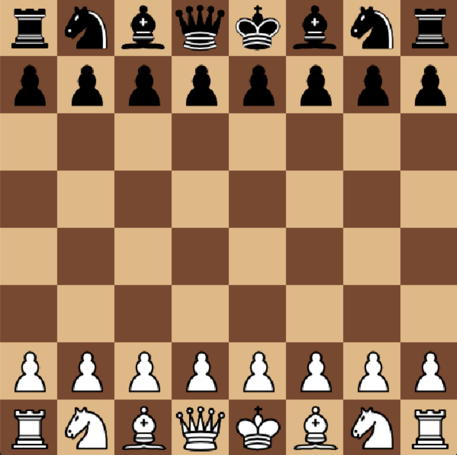
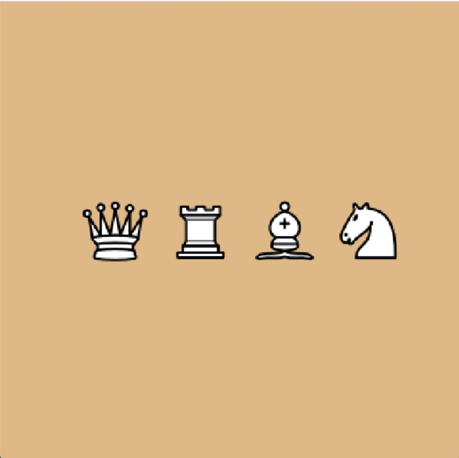
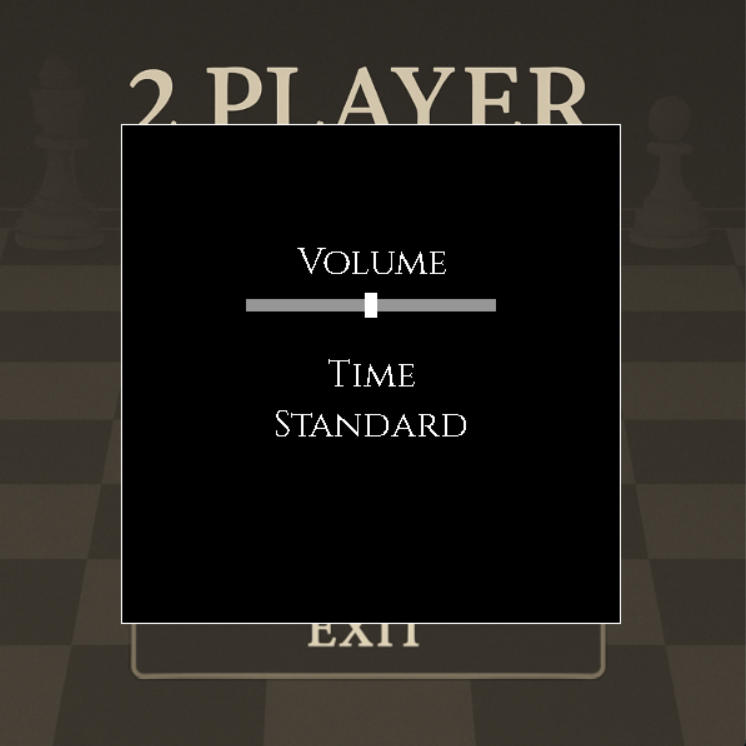

# 2 PLAYER CHESS

**1.Tác giả**

  * Họ và tên: Đặng Công Anh
  
  * Mã sinh viên: 24021357

**2.Giới thiệu game**

  * Lấy ý tưởng từ cờ vua cổ điển
  
  * 2 người chơi điều khiển 2 phía của bàn cờ đến khi thắng hoặc hòa

  * Ngưỡng điểm mong muốn: 9+

**3.Điểm nổi bật**

  * Hệ thống nước đi chuẩn.
  
  * Logic chiếu, chặn, ghim, hòa cờ, checkmate, stalemate, en passant,...

  * SFX khi đặt quân, background music
     
  * Chỉnh sửa volume:
  

   
**4.Nguồn hình ảnh / âm thanh**
  
  * [SFX & Sprites](https://www.chess.com/forum/view/general/chessboard-sound-files?page=1).

**5.Nguồn tham khảo và mức độ sử dụng AI**

  * Cách tạo bàn cở và những nước cơ bản (https://youtu.be/Shtdw7yb5VY?si=-JqpNjXGhv1A1ZUU).

  * Mức độ sử dụng AI: Giải thích những phần code chưa hiểu khi tìm hiểu trên các trang reference.
